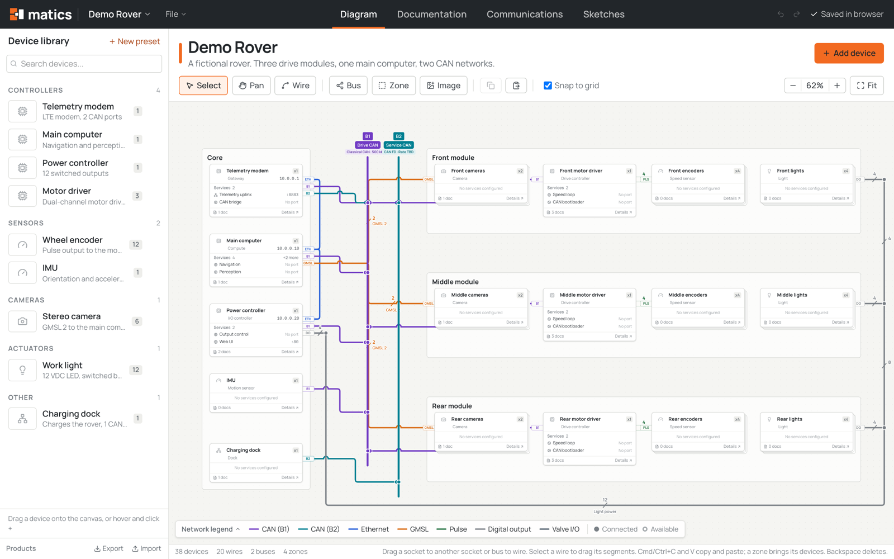
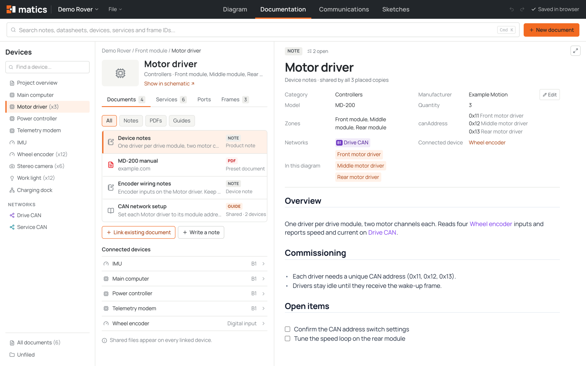
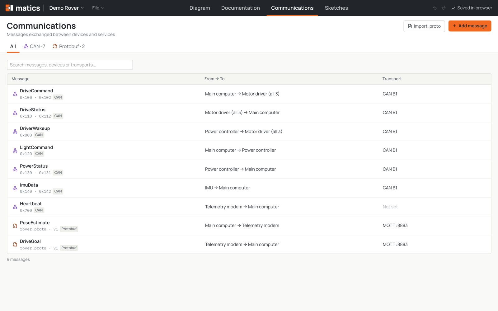

<p align="center">
  
</p>

<h1 align="center">Matics</h1>

<p align="center">
  Wiring diagrams and system documentation for hardware teams, in one desktop app.
</p>

<p align="center">
  <a href="https://github.com/KyleAlanJeffrey/matics/releases/latest">Download</a>
  &nbsp;|&nbsp;
  <a href="#quickstart">Quickstart</a>
  &nbsp;|&nbsp;
  <a href="docs/01-data-model.md">Data model</a>
  &nbsp;|&nbsp;
  <a href="CONTRIBUTING.md">Contributing</a>
</p>

<p align="center">
  
</p>

Matics keeps the drawing of a machine and everything known about it in the same place.
Place devices, wire their ports to shared networks, and every device, network and
message gets a page for its datasheets, notes and open questions. When the design
changes, the documentation changes with it.

## Features

- **Schematic.** Device cards with ports, wires, shared buses, zones, quantity stacks
  and pictures. Snap to grid, route wires by hand, copy and paste whole zones.
- **Documentation.** A page for every device, network and service: linked PDFs and web
  pages, a markdown editor with `[[wiki-links]]`, backlinks and checklists. One document
  can be shared by several devices.
- **Communications.** CAN frame allocations (read from DBC files or entered by hand) and
  Protobuf messages imported from `.proto` files, each with its sender, receivers and
  transport.
- **Sketches.** A built-in whiteboard for rough ideas, with shapes that link to the
  devices they describe.
- **Report.** A printable summary of the whole system (schematic, parts list, networks,
  connections, frames and notes) as a PDF or PNG.
- **Plain files.** A project is a folder with `project.json` and its attachments. Share
  one as a single `.matics` package.

## Download and install

Get the latest installer from the
[Releases page](https://github.com/KyleAlanJeffrey/matics/releases/latest).

| Platform | File | Install |
| --- | --- | --- |
| macOS (Apple Silicon and Intel) | `Matics_<version>_universal.dmg` | Open the disk image and drag Matics into Applications. |
| Windows 10 and 11 | `Matics_<version>_x64-setup.exe` or `Matics_<version>_x64_en-US.msi` | Run the installer. |
| Linux | `.AppImage`, `.deb` or `.rpm` | Make the AppImage executable and run it, or install the package. |

The builds are not code signed yet, so the first launch needs one extra step:

- **macOS:** if macOS says the app "is damaged" or "cannot be verified", run
  `xattr -dr com.apple.quarantine /Applications/Matics.app`, then open it again.
  On first launch Matics asks for access to your Documents folder, where projects live.
- **Windows:** in the SmartScreen prompt, choose **More info**, then **Run anyway**.

After that, Matics keeps itself up to date: when a new build is out, an **Update** button
appears in the header. Click it and choose **Restart and update**; your project is saved
first. **Check for updates** in the File menu (on macOS, in the Matics menu) asks right
away. Copies installed from the `.msi`, `.deb` or `.rpm` update by installing the new
package.

## Quickstart

1. **Open Matics.** The first launch opens the Demo Rover sample, a small fictional
   robot to explore. Start your own with **File > New Diagram** (Cmd+N).
2. **Add devices.** Drag a product from the Device library onto the canvas, or click
   **Add device**. Draw a **Zone** around devices that belong together.
3. **Wire them up.** Add a **Bus** for each shared network (CAN, Ethernet), then drag
   from a port tab on a card to a bus or to another port.
4. **Document as you go.** Select a device and open **Details**, or switch to
   **Documentation** (Cmd+2). Link datasheets, write notes and add services.
5. **Describe the traffic.** In **Communications** (Cmd+3), import a DBC or `.proto`
   file, then set who sends and receives each message.
6. **Share it.** **File > Package Project** (Cmd+Shift+S) writes one `.matics` file.
   Double-click it on another machine to open the project there. **File > Export Report
   as PDF** (Cmd+P) makes a printable copy.

Projects save automatically to `~/Documents/Matics/<project>/`.

<p align="center">
  
</p>

<p align="center">
  
</p>

## Keyboard shortcuts

| Action | macOS | Windows and Linux |
| --- | --- | --- |
| New diagram | Cmd+N | Ctrl+N |
| Diagram, Documentation, Communications, Sketches, Report | Cmd+1 to Cmd+5 | Ctrl+1 to Ctrl+5 |
| Search documentation | Cmd+K | Ctrl+K |
| Undo / redo | Cmd+Z / Cmd+Shift+Z | Ctrl+Z / Ctrl+Shift+Z |
| Copy / paste devices | Cmd+C / Cmd+V | Ctrl+C / Ctrl+V |
| Select, pan, wire tools | V, H, W | V, H, W |
| Save | Cmd+S | Ctrl+S |
| Open a project folder / a `.matics` package | Cmd+O / Cmd+Shift+O | Ctrl+O / Ctrl+Shift+O |
| Package the project | Cmd+Shift+S | Ctrl+Shift+S |
| Export the report as PDF | Cmd+P | Ctrl+P |

## Projects and files

A project is a folder you can sync, copy or put in version control:

```
~/Documents/Matics/<project>/
  project.json   devices, wiring, networks, messages, notes and sketches
  assets/        device pictures and attached documents
```

A `.matics` file is that folder zipped into one file. Opening one creates a new project
next to your others, so it never overwrites work in progress. Existing folders open with
**File > Open Project Folder**.

## Build from source

You need Node 22+, pnpm 10+ and Rust stable ([rustup.rs](https://rustup.rs)). Linux
also needs the WebKitGTK development packages listed in the
[Tauri prerequisites](https://v2.tauri.app/start/prerequisites/).

```bash
pnpm install
pnpm desktop:dev
```

`pnpm desktop:build` writes installers to `src-tauri/target/release/bundle/`. Every push
to main builds macOS, Windows and Linux installers in GitHub Actions and publishes them as
a new release (see [VERSIONING.md](VERSIONING.md)).

Other scripts:

| Command | What it does |
| --- | --- |
| `pnpm dev` | The UI alone in a browser, stored in IndexedDB. No filesystem, so project pictures and files do not load. |
| `pnpm test` | Unit tests (Vitest) |
| `pnpm typecheck` | TypeScript checks |
| `pnpm build` | Frontend production build |

### Code layout

```
src/model       types, sample project, parsers (DBC, .proto), derived data
src/store       project store with undo; disk storage in the app, IndexedDB in the browser
src/views       one folder per page: diagram, notes, communications, frames, sketches, report
src/components  app shell and shared UI
src/lib         desktop commands, assets, menus, file saving
src-tauri       the desktop shell: window, macOS menu bar, project folders, packages, updates
docs/           decisions, data model and development notes
```

## Status

Matics is an early alpha and changing quickly. Until 1.0, any release may change the project
format, and projects from older builds are not upgraded. See
[COMPATIBILITY.md](COMPATIBILITY.md) and the known gaps in the
[development notes](docs/02-dev-log.md).
